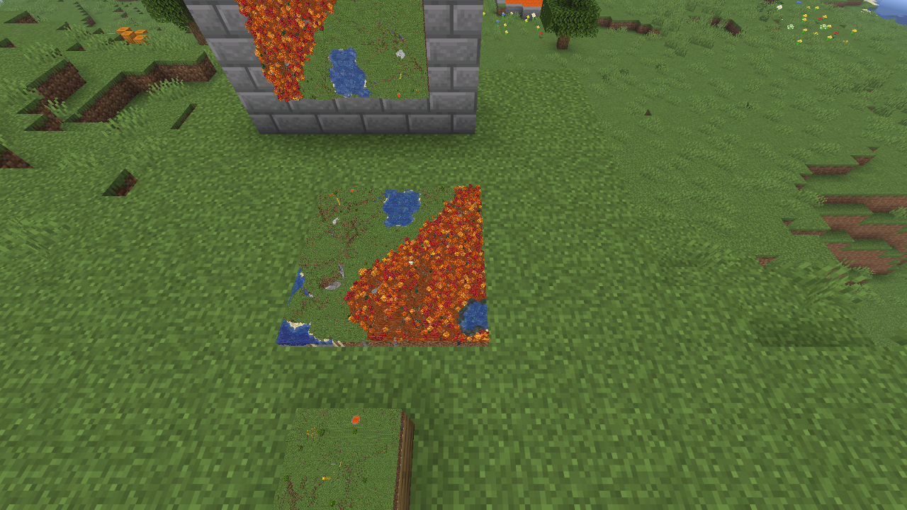
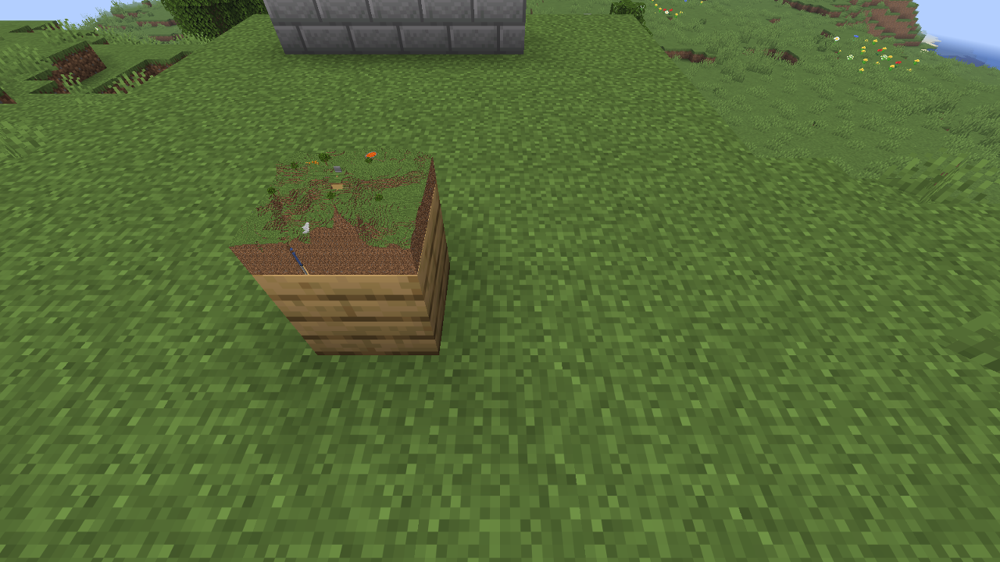
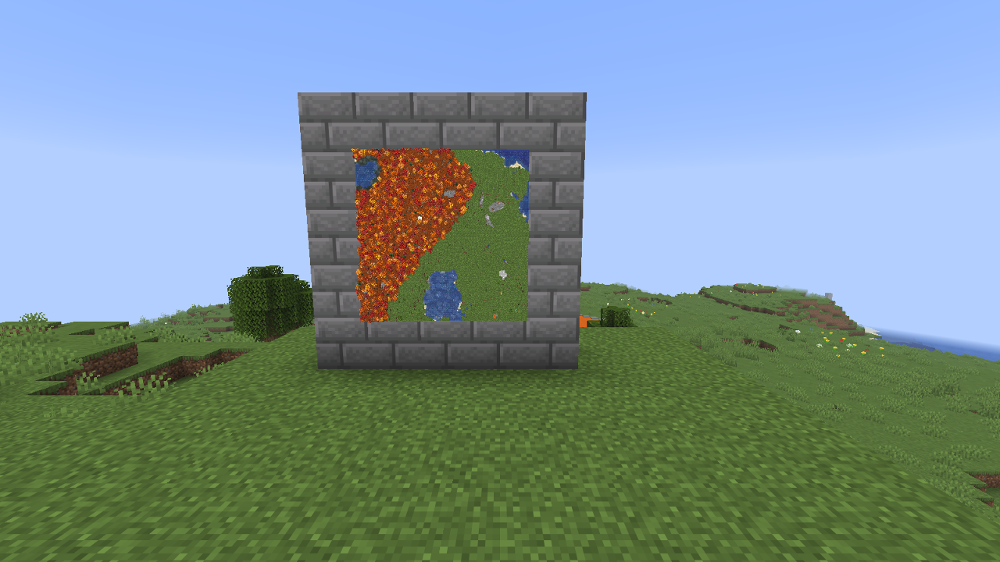
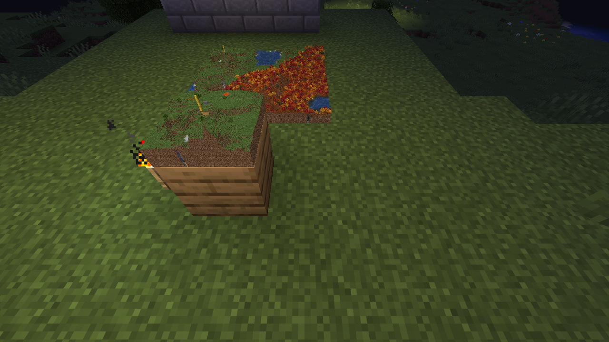

# HoloMap

[](https://www.minecraft.net)
[](https://fabricmc.net)
[](https://github.com/xferbe/holomap/actions/workflows/build.yml)
[](LICENSE)
<!-- TODO: Modrinth downloads badge once the project is approved:
[](https://modrinth.com/mod/holomap) -->

Hang a map in an item frame and it becomes a 3D model of the terrain: hills, trees, houses and rivers, built from
the game's own block textures and kept up to date while you play. Maps placed side by side join into one big 3D map.



## Features

- **The map is the model.** Any filled map in an item frame becomes a diorama of its area. It works on the floor,
  on a wall and on the ceiling, at every map scale.
- **The game's own look.** Each block uses its model's textures, with biome colors for grass, leaves and water.
  Resource packs show up too.
- **Live.** Place or break a block inside the map's area and the diorama updates in under half a second.
- **Map walls.** Neighbouring maps fit together into one large 3D map, the same way vanilla joins flat maps.
- **Far terrain from the server.** The server remembers every chunk it has loaded, so a map of a place you
  explored last week still shows it, and your friend sees what you explored.
- **Invisible frame.** A frame holding a map is drawn without its border, so only the diorama is left. It is only
  visual: you can take the map out as usual.
- **Day and night.** The diorama gets darker at night along with the world; torches still light it.
- No keys, no screens. Hang the map and that is it.

| A map on a table | A wall of 9 maps |
| --- | --- |
|  |  |



## Download

<!-- TODO: link the Modrinth page once it is approved. -->
Download the jar from the [releases](https://github.com/xferbe/holomap/releases). Coming soon to Modrinth.

## Installation

1. Install [Fabric Loader](https://fabricmc.net/use/) for Minecraft 26.3.
2. Put [Fabric API](https://modrinth.com/mod/fabric-api) and the HoloMap jar in your `mods` folder.

The same jar works on the client and on the server.

- **Singleplayer and LAN:** install it on every player's game. The one who opens the world to LAN runs the server
  side for everyone.
- **Dedicated server:** install it on the server too. Without it, dioramas still work, but they only show the
  terrain your own game has loaded.
- Use the same HoloMap version on both sides. If they differ, you get a message in chat and the dioramas fall back
  to local terrain only.

## Configuration

`config/holomap.json` is created on the first launch. Values out of range go back to the default.

| Option | Default | What it does |
| --- | --- | --- |
| `verticalScale` | `1.0` | Multiplies the height of the terrain. `2.0` makes flat land easier to read. |
| `lodDistances` | `[8, 20, 40]` | Distances (blocks) at which a diorama switches to 2, 4 and 8 columns per cell. |
| `gpuMemoryMb` | `256` | Video memory for dioramas. Over it, the least recently seen ones are dropped first. |
| `chunksPerSecond` | `40` | Server: chunks of far terrain sent to each player per second. |

Two commands show what the dioramas cost right now:

- `/holomapstats` (client): dioramas, faces, video memory, build times and terrain received.
- `/holomap info` (server): stored chunks per dimension, size on disk and the send queues.

## Adding and removing the mod

- **Adding it** to an existing world works right away. Maps of places the server has not loaded since then show
  only what your game has loaded until someone visits them.
- **Removing it** leaves the world intact: it adds no blocks, items or entities, and stores nothing on chunks.
  Maps go back to flat vanilla maps. The terrain it remembers lives in `holomap/` inside the world folder, which the
  game ignores and you can delete.

## Reporting issues

Open an [issue](https://github.com/xferbe/holomap/issues) with the mod version, the Minecraft version, your
`logs/latest.log` and, for performance, the output of `/holomapstats`.

## How it works

```text
server (integrated or dedicated)                     client
────────────────────────────────                     ──────
chunk loads or changes ─► block stack of each ─┐
                         column (top → ground) │     chunks near you: read
                                               ▼     locally, redone the tick
              stored terrain (memory + save)        after any block change
                                               │               │
client: "I am looking at maps of this area" ───┤               ▼
                                               ▼         client 3D terrain
     queue per player, nearest first, only     ──────────►        │
     what changed and the client has not loaded                   ▼
                    copy of the area (game thread) ─► mesh (worker thread) ─► GPU
                                                                               │
                    frame with a map: draws the mesh with the frame's matrix ◄─┘
```

- **A stack per column, not just the top.** For every column the mod keeps the blocks from the top down to solid
  ground (the first opaque block that is not a log or leaves), plus the biome. Below that the column is solid. This is
  what makes a tree look like a tree instead of a green pillar.
- **The diorama lives in the map's own space** (128×128, with the frame's direction and rotation), so it works on any
  face, and neighbouring maps fit together by themselves. Height uses the map's scale: on a scale 0 map, one block
  of height is one map pixel.
- **The mesh is built once and kept on the GPU.** The game thread only copies the map's area (at most one map per
  tick); the faces are generated on a low priority worker thread. Each frame just draws the stored mesh.
- **Only visible faces.** Faces against opaque blocks are skipped, and leaves next to leaves become one solid block,
  like Fast graphics.
- **Level of detail by distance:** every column up to 8 blocks away, then cells of 2×2, 4×4 and 8×8 columns.
- **Rebuilt only on change.** Every chunk remembers when it changed; a diorama checks its own area every 4 ticks and
  rebuilds at most 4 times a second.
- **The server is the source of far terrain.** A block change only marks its chunk, which is read again at most every
  half second. Each player has a send queue that reads only the chunks that changed, and skips the ones the player
  already has loaded.

## Building from source

Requires JDK 25.

```bash
./gradlew build              # jar in build/libs, runs the unit tests
./gradlew runClient          # dev client
./gradlew runClientGameTest  # opens the game, builds a test scene, takes screenshots, measures a 3×3 wall
```

The game test runs in a world with a fixed seed. Screenshots go to `build/run/clientGameTest/screenshots`, and the
load test numbers to `build/run/clientGameTest/holomap-stats.txt`.

Project layout:

```text
src/main      common code (runs on the server and the client)
  terrain/       ChunkSummary (column stacks), TerrainSampler, LodPolicy
  server/        HolomapServer (send queues, commands), ServerTerrainStore (memory, change log, save)
  net/           packets
  mixin/         ServerLevelMixin (block changes)
src/client    client only
  terrain/       ClientTerrain (local + server terrain)
  look/          BlockLooks (textures and biome tints from block models)
  diorama/       DioramaBuilder (mesh), DioramaManager (GPU, level of detail, drawing)
  mixin/         item frame, level renderer and block change hooks
src/test      unit tests
src/gametest  client game test with screenshots and the load test
```

## AI disclosure

Contains AI-generated code and text.

## License

MIT, see [LICENSE](LICENSE).
